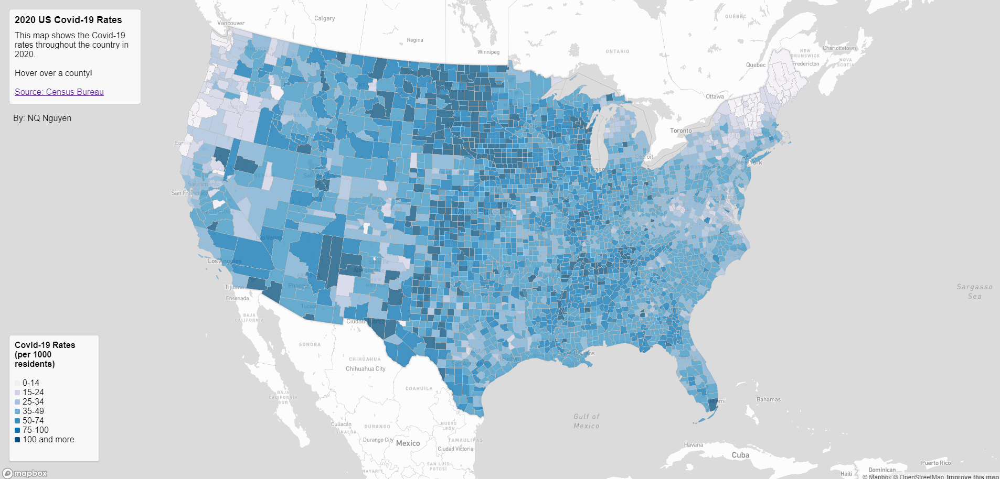
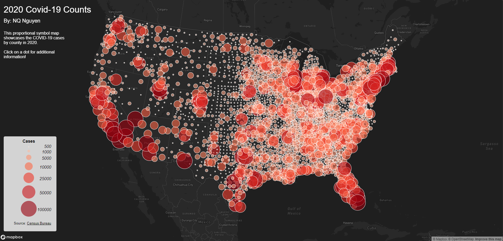
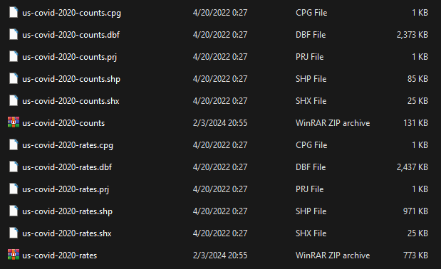

# 2020 Covid-19 Rate and Count Maps

### Introduction
This project showcases how the United States was affected by COVID-19 during 2020 using data from the [Census Bureau](https://data.census.gov/cedsci/table?g=0100000US.050000&d=ACS%205-Year%20Estimates%20Data%20Profiles&tid=ACSDP5Y2018.DP05&hidePreview=true). Both maps use the same dataset and projection, however the themes differ as one is a choropleth map highlighting the COVID-19 rates per 1000 people in each county, while the other is a proportional symbol map highlighting the overall number of cases in each county.

> Choropleth displaying the rates per county with an interactive hover element that shows additional information such as number of deaths, cases, and etc.
[Choropleth map link](https://qnn16.github.io/2020covidratescounts/map1.html)

> Proportional symbol displaying the number of COVID-19 cases per county. Additional information can be found by clicking on each of the proportional symbols.
[Proportional map symbol link](https://qnn16.github.io/2020covidratescounts/map2.html)

### Acknowledgements

[Mapshaper](https://mapshaper.org/) was used to filter data and convert the shapefile along with various other files into a geoJSON, which was used to create both maps with HTML and CSS.  
[ColorBrewer](https://colorbrewer2.org/#type=sequential&scheme=BuGn&n=3) was also used to select color schemes for the maps in the form hex codes in a JS array.  
The case/death data is from [The New York Times](https://github.com/nytimes/covid-19-data/blob/43d32dde2f87bd4dafbb7d23f5d9e878124018b8/live/us-counties.csv).
